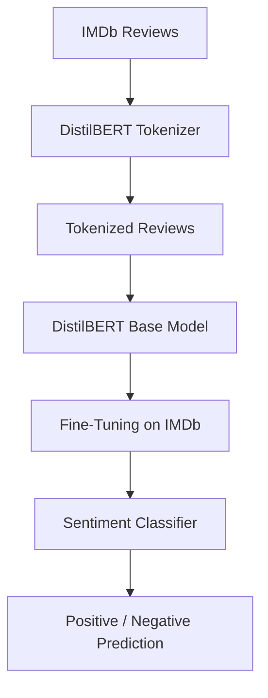

# SentimentLens AI


Enterprise-grade sentiment analysis for reviews and user text.

---

## Overview

SentimentLens AI is a production-oriented toolkit and model for sentiment classification and review analytics. It combines fine-tuned Hugging Face transformer models with classical scikit-learn baselines, benchmarked on the IMDB dataset for reliable performance and reproducibility.

---

### Scope

Primary development target: movie reviews (IMDB benchmark). The system and training pipeline are designed to be domain-agnostic and can be extended to product reviews, social media posts, support tickets, and other text domains with minimal data-specific adjustments.

---

## Key features

- Fine-tuned transformer models (Hugging Face) for high-accuracy sentiment classification
- Classical ML baselines using `scikit-learn` for fast experimentation
- Evaluation and benchmarking on the IMDB dataset
- Reproducible training checkpoints and tokenizer artifacts
- Lightweight inference script for quick predictions (`test.py`)

---

## Tech stack

- `transformers` (Hugging Face)
- `PyTorch`
- `scikit-learn`
- `datasets` (Hugging Face)

---

## Quick start

1. Create and activate a Python virtual environment:

```bash
python -m venv .venv
# Windows
.\\.venv\\Scripts\\activate
# macOS / Linux
source .venv/bin/activate
```

2. Install essentials (adjust versions as needed):

```bash
pip install transformers torch datasets scikit-learn
```

3. Run inference with the included `test.py` (uses local `sentiment-model` directory):

```bash
python test.py
```

---

## Notes on training

- Training scripts and checkpoints should save model files and tokenizer in a directory such as `sentiment-model/` or `results/checkpoint-<step>/`.
- Use the IMDB dataset from Hugging Face `datasets` for standard benchmarking and evaluation splits.

---

## Evaluation

Track accuracy, precision/recall, and F1. Keep a concise evaluation report (for example `results/eval_report.md`) alongside checkpoint artifacts.

---

## Model & Training

### Pretrained Model

DistilBERT

### Dataset

IMDb Dataset

### Fine-Tuning Process

1. Loaded the pretrained DistilBERT model.
2. Loaded the IMDb dataset.
3. Tokenized text reviews.
4. Added a classification head.
5. Fine-tuned the model on labeled sentiment data.
6. Evaluated the model on a test set.
7. Saved the trained model.

### Output

The model predicts `Positive` or `Negative` for any movie review.

---

## What you accomplished

Your training pipeline was:



You:

1. Loaded a pretrained DistilBERT model.
2. Loaded the IMDb sentiment dataset.
3. Tokenized the reviews.
4. Fine-tuned the model on labeled reviews.
5. Saved the trained model.
6. Tested it using a `sentiment-analysis` pipeline.

---

## Project structure (example)

- `test.py` — lightweight inference example
- `train.py` — training script
- `results/` — training checkpoints and reports
- `sentiment-model/` — exported model + tokenizer for inference

---

## 📬 Contact & Contribution

- 🔗 **LinkedIn:** <a href="https://www.linkedin.com/in/ahmed-maher-algohary" title="Contact via LinkedIn">https://www.linkedin.com/in/ahmed-maher-algohary</a>
- 📧 **Email:** <a href="mailto:ahmedmaher.dev1@gmail.com" title="Contact via Email">ahmedmaher.dev1@gmail.com</a>

> Contributions, suggestions, and bug reports are welcome. Feel free to open issues or pull requests.

---

## ⭐ Support

If you found this project helpful or inspiring, please consider giving it a ⭐. Your support helps me grow and share more open-source projects like this!

---

## License

This project is released under the GNU Affero General Public License v3.0 (AGPL-3.0). See the included [LICENSE](LICENSE) for full terms. The AGPL is a strong copyleft license and requires that modified versions made available over a network also make their source code available.
